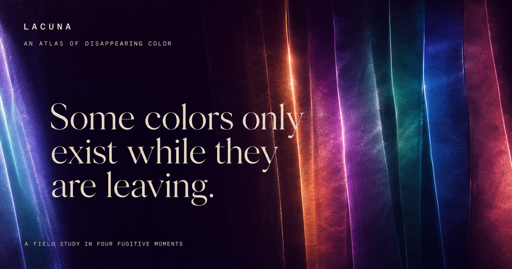

# LACUNA — An Atlas of Disappearing Color

LACUNA is a cinematic interactive field study about colors that only exist while conditions are changing. Movement agitates a procedural light field; stillness lets its translucent layers resolve.

[Open the live experience](https://lacuna-disappearing-color-atlas.netlify.app)



## Experience

- Four narrative chapters: Pre-blue, Glass Heat, Rain Memory, and Borrowed Hour
- A performant Canvas light field with directional refraction rather than particle or blob effects
- Stillness-aware marginalia, pointer shear, manual film frames, rain distillation, and a linger state
- A generated light specimen that records the visitor’s current chapter and Central Time
- Persistent global motion control with automatic reduced-motion support
- Semantic story structure and complete keyboard, pointer, and touch parity

## Architecture

- Next.js 16 App Router and React 19
- TypeScript and a small deterministic Canvas 2D renderer
- Native HTML controls and CSS-driven chapter compositions
- No authentication, database, analytics tracker, third-party runtime API, sound, or external imagery
- Native Netlify build plus a Cloudflare-compatible Sites build

## Local development

```bash
npm install
npm run dev
```

## Release checks

```bash
npm run verify
```

The release suite covers linting, type safety, rendered-output tests, both production builds, and the production dependency audit. The same suite runs on every push and pull request through GitHub Actions.

See the [production release evidence](docs/release-evidence.md) and the [latest public release](https://github.com/shanto12/lacuna-disappearing-color-atlas/releases/latest) for the live verification record.
